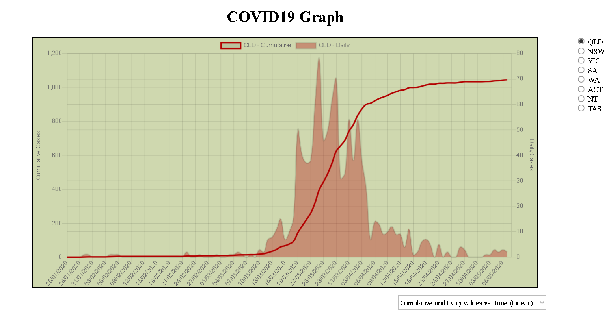

# COVID-19 Graph - Australia

Data source from Guardian Australia

https://www.theguardian.com/australia-news/datablog/ng-interactive/2020/apr/15/coronavirus-australia-numbers-how-many-new-cases-today-deaths-death-toll-covid-19-stats-graph-map-by-postcode

https://interactive.guim.co.uk/docsdata/1q5gdePANXci8enuiS4oHUJxcxC13d6bjMRSicakychE.json

Inspiration taken from Minutephysics
(https://www.youtube.com/watch?v=54XLXg4fYsc) and (https://aatishb.com/covidtrends/)